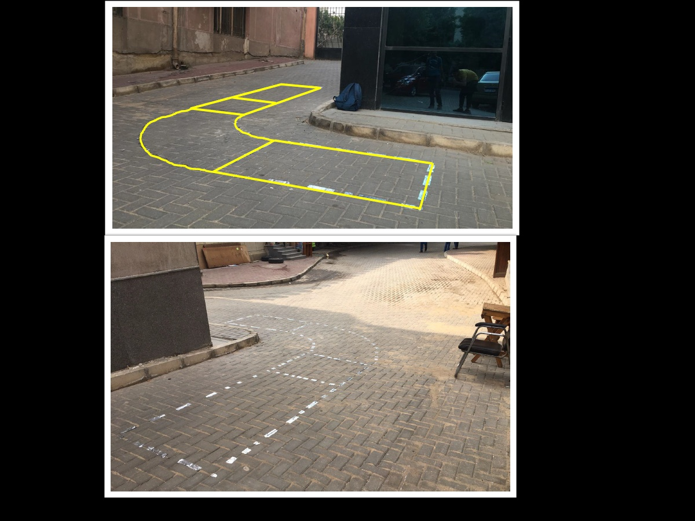

# CarControlleWithBluetoothApp

# Descreption

The aim of this project is to design and manufacture a prototype for a car chassis with steering and braking. This prototype is the scaled-down model for the full-scale chassis which will participate in the racing Aeolus competition in Den Helder, the Netherlands in August 2023. The winning team of the Machine Elements Design Fall 2022 competition will join the ASUWind team and build the full-scale car based on their winning designs. More information about the competition can be found in the following link:( https://www.racingaeolus.online/ ) 

# Project position in the competition
- 4th out of 20 teams

##
- Arduino
- scoped_model: ^2.0.0-nullsafety.0
- animated_splash_screen: ^1.3.0
- flutter_bluetooth_serial: ^0.4.0

# Project Photos
- App ScreenShots

- Car

- Car Video

- Location

